USAGE
-----

> **NOTE** This usage assumes that user has already created and logged in to **Microsoft Azure Account**.

Steps:
1. Create Azure Resource Group. Please check section **CREATE RESOURCE GROUP**
1. Create Azure App Service. Please check section **CREATE APP SERVICE**
1. Create Azure App Service Deployment Center. Please check section **CREATE DEPLOYMENT CENTER**
1. Delete Azure App Service. Please check section **DELETE APP SERVICE**
1. Delete Azure Resource Group. Please check section **DELETE RESOURCE GROUP**

DESCRIPTION
-----------

##### Goal
The goal of this project is to present how to work with **Microsoft Azure App Services** using **Azure Platform**. 

Azure Platform is web console for Azure Resources. Using this console user can work with Azure Resources via browser.

Azure App Service enables to deploy web application in Azure Cloud. 

This project presents:
* How to create Azure App Service type **code** for **Java** Runtime stack. Code means that pure package is used for deployment - for instance for Java it's "jar" file. 
* How to deploy **Java Spring Boot** application using **Azure App Services Deployment Center** from **Github** repository. Code from Github is deployed in Azure by **Github Actions** which are automatically created and deployed on Github during this deployment.
* How to remove all Azure Resources after work.

CREATE RESOURCE GROUP
---------------------

Azure link:
* https://azure.microsoft.com

CREATE APP SERVICE
------------------

Azure link:
* https://azure.microsoft.com

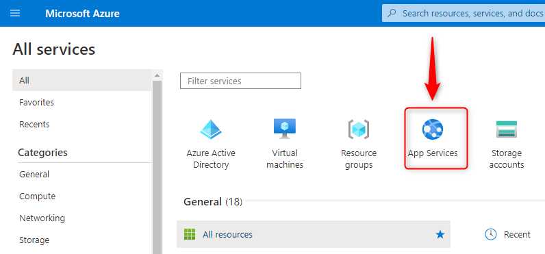

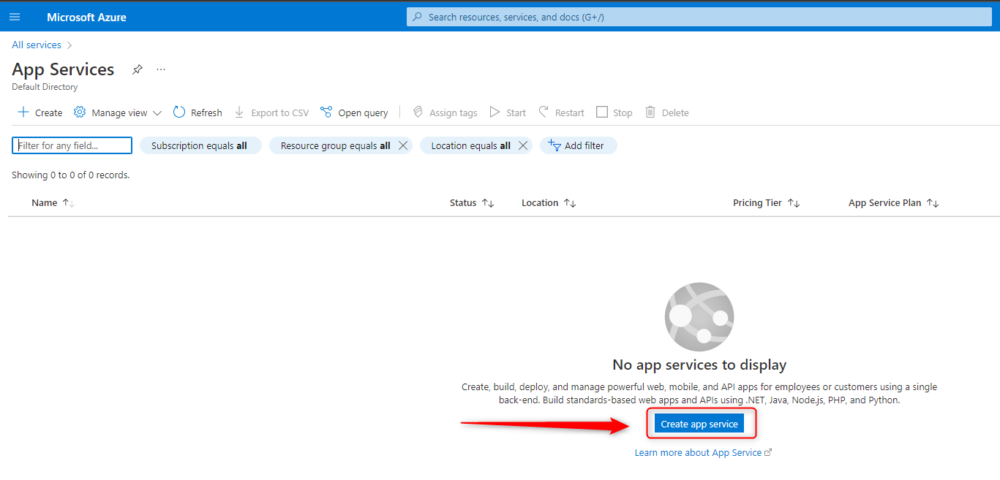

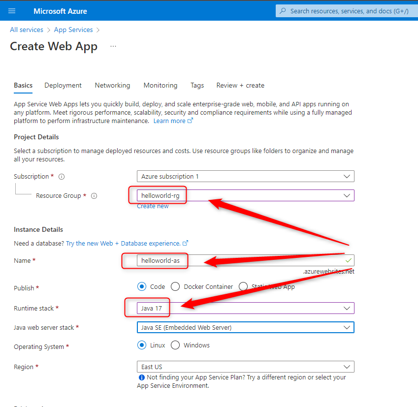

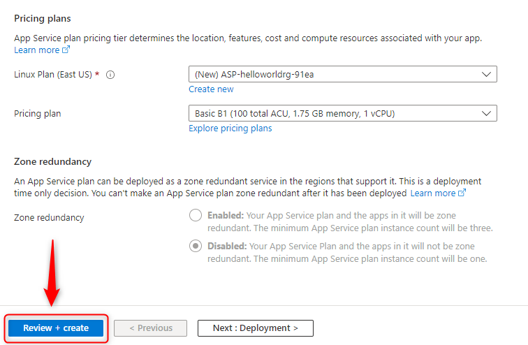

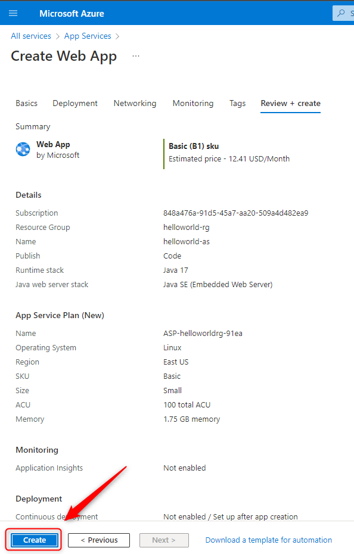

CREATE DEPLOYMENT CENTER
------------------------

Azure link:
* https://azure.microsoft.com

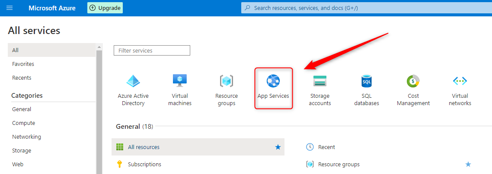

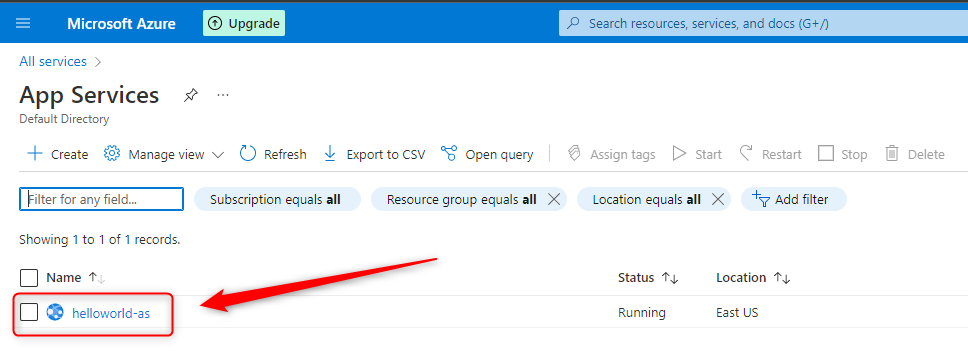

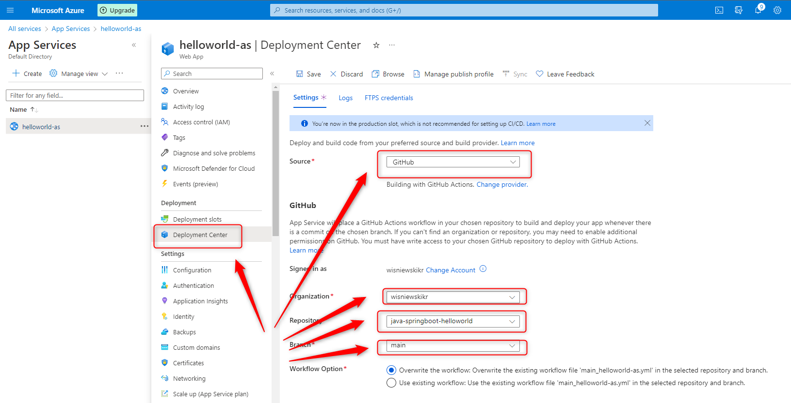

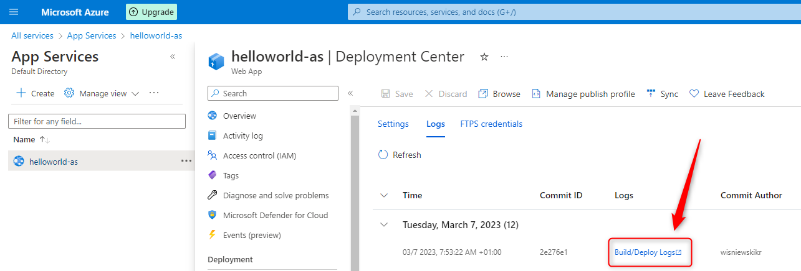

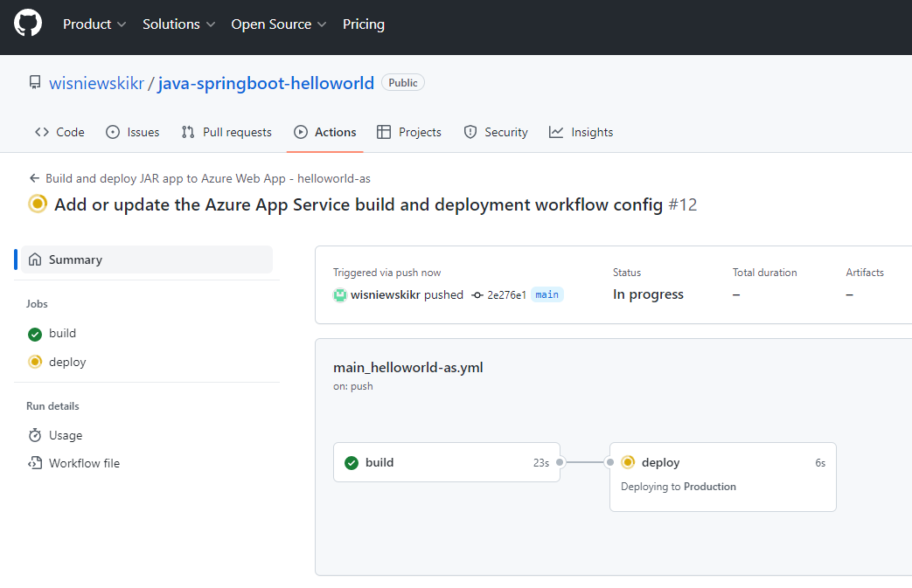

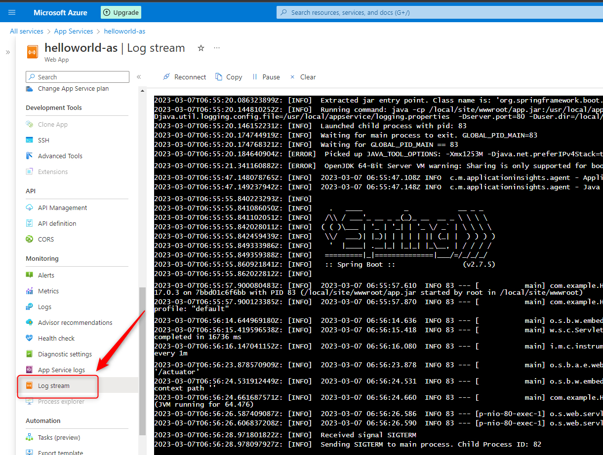

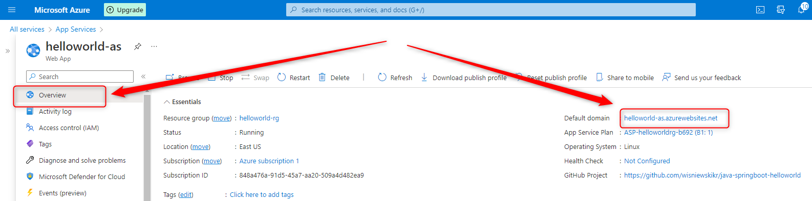

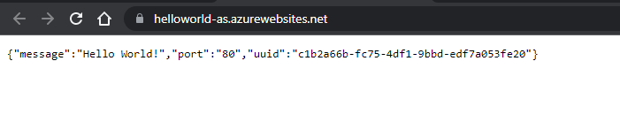

DELETE APP SERVICE
------------------

Azure link:
* https://azure.microsoft.com

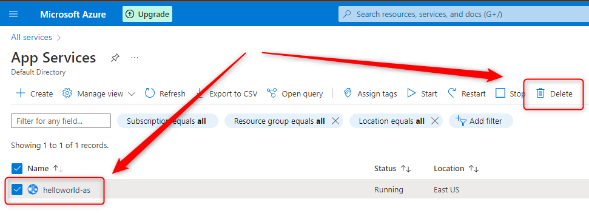

DELETE RESOURCE GROUP
---------------------

Azure link:
* https://azure.microsoft.com

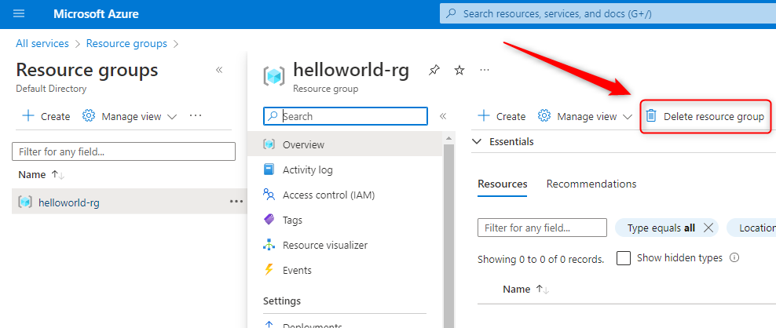

