USAGE
-----

> **NOTE** This usage assumes that user has already created and logged in to **Microsoft Azure Account**.

Steps:
1. Create Azure Resource Group. Please check section **CREATE RESOURCE GROUP**
1. Create Azure Container Instance. Please check section **CREATE CONTAINER INSTANCE**
1. Delete Azure Container Instance. Please check section **DELETE CONTAINER INSTANCE**
1. Delete Azure Resource Group. Please check section **DELETE RESOURCE GROUP**

DESCRIPTION
-----------

##### Goal
The goal of this project is to present how to configure **Microsoft Azure Container Instance** using **Azure Portal**. **Java Spring Boot** application from Docker Image will be automatically installed after this configuration.

##### Terminology
Terminology explanation:
* **Azure Portal**: this is web console for Azure Resources. Using this console user can work with Azure Resources via browser
* **Azure Container Instance**: it's service provided by Azure for deploying Docker Containers
* **Java Spring Boot application**: application in Java programming language which uses Spring Boot framework. This application just displays text "Hello World!"

##### Flow
The following flow takes place in this project:
1. User creates Azure Resource Group via Azure Portal
1. User creates Azure Container Instance and installs there Docker Image
1. User via any browser sends request to application for a content.
1. Application HelloWorld returns response with JSON containing message, port and UUID. This response is presented to User via browser.
1. User removes all Azure Resources via Azure Portal

##### Launch
To launch this application please make sure that the **Preconditions** are met and then follow instructions from **Usage** section.

##### Technologies
This project uses following technologies:
* **Java**: `https://docs.google.com/document/d/119VYxF8JIZIUSk7JjwEPNX1RVjHBGbXHBKuK_1ytJg4/edit?usp=sharing`
* **Maven**: `https://docs.google.com/document/d/1cfIMcqkWlobUfVfTLQp7ixqEcOtoTR8X6OGo3cU4maw/edit?usp=sharing`
* **Git**: `https://docs.google.com/document/d/1Iyxy5DYfsrEZK5fxZJnYy5a1saARxd5LyMEscJKSHn0/edit?usp=sharing`
* **Spring Boot**: `https://docs.google.com/document/d/1mvrJT5clbkr9yTj-AQ7YOXcqr2eHSEw2J8n9BMZIZKY/edit?usp=sharing`
* **Docker**: `https://docs.google.com/document/d/1tKdfZIrNhTNWjlWcqUkg4lteI91EhBvaj6VDrhpnCnk/edit?usp=sharing`
* **Microsoft Azure**: `https://docs.google.com/document/d/1HaL4gve9FyrSS2Zi7NrhHN4Y2siD_sXJugnOuGhjhCc/edit?usp=sharing`

PRECONDITIONS
-------------

##### Preconditions - Tools
* Installed **Operating System** (tested on Windows 10)

##### Preconditions - Actions
* Created Azure account
* Java Spring Boot application source code: `https://github.com/wisniewskikr/java-springboot-helloworld`

CREATE RESOURCE GROUP
---------------------

Azure link:
* https://azure.microsoft.com

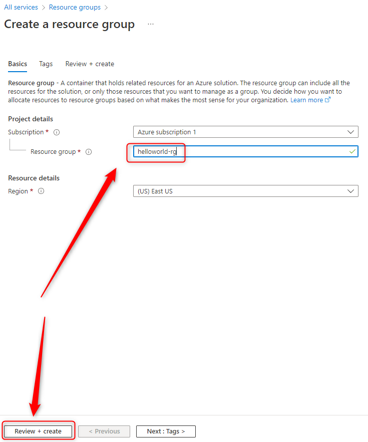

CREATE CONTAINER REGISTRY
-------------------------

Azure link:
* https://azure.microsoft.com

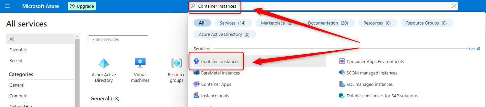

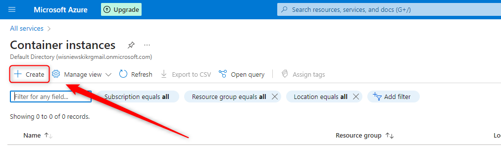

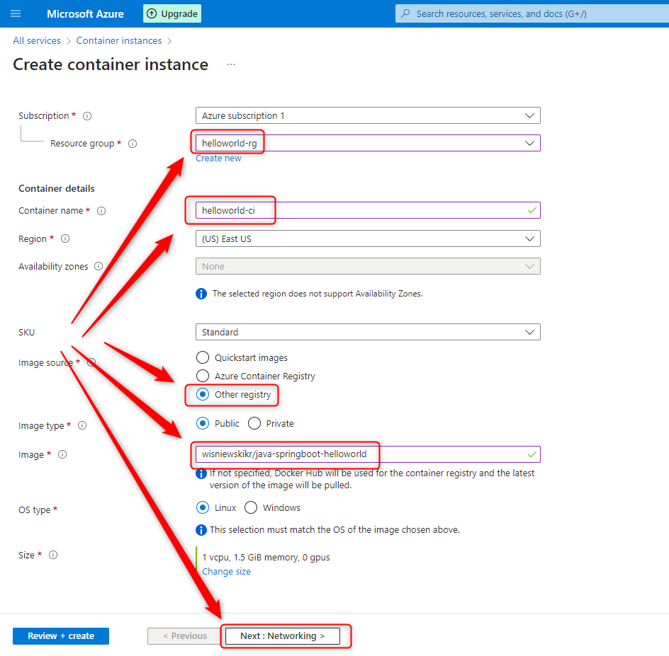

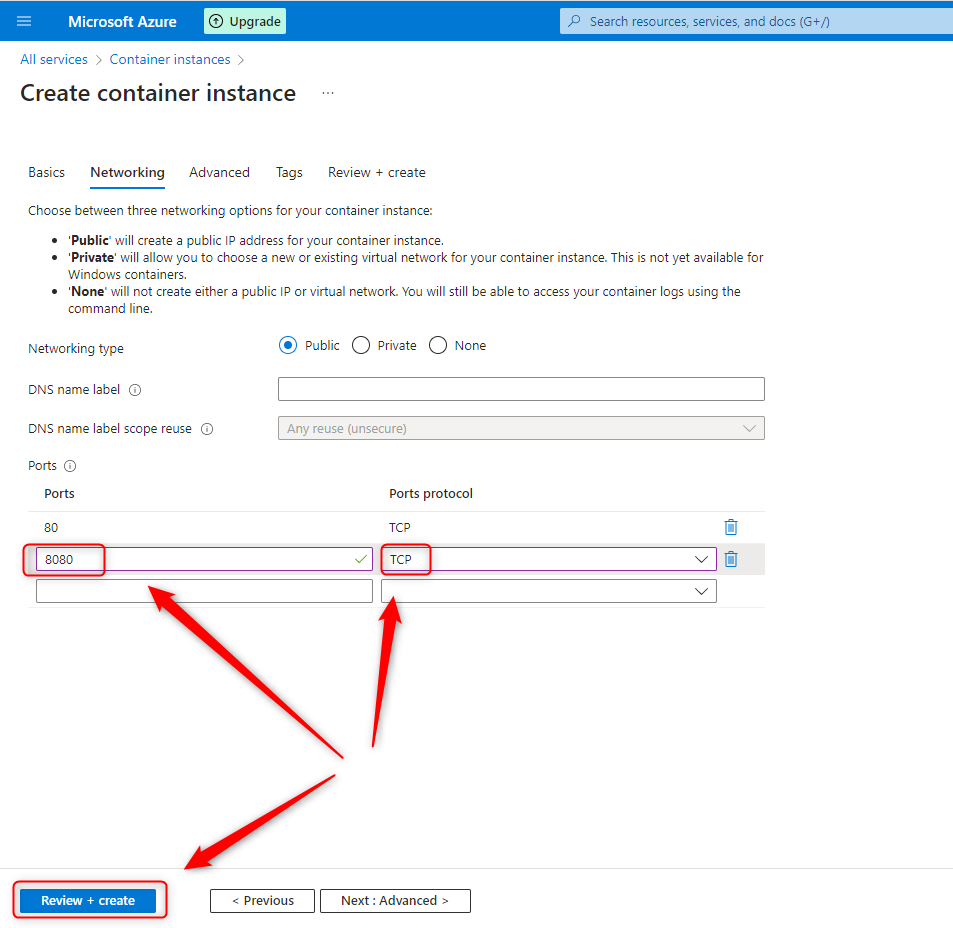

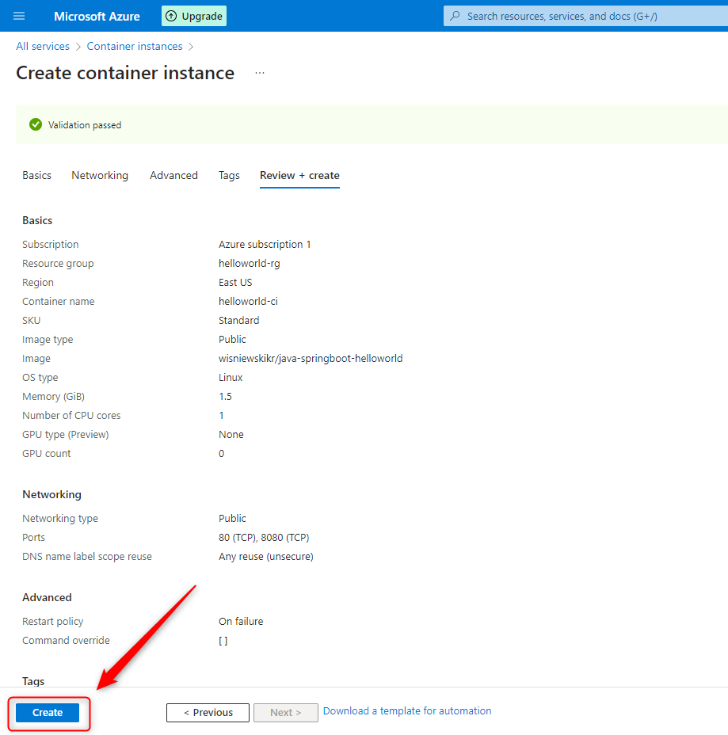

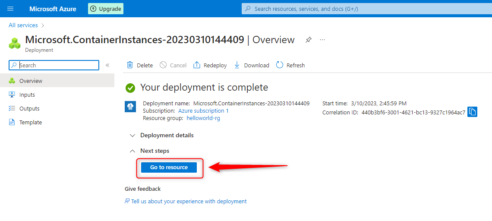

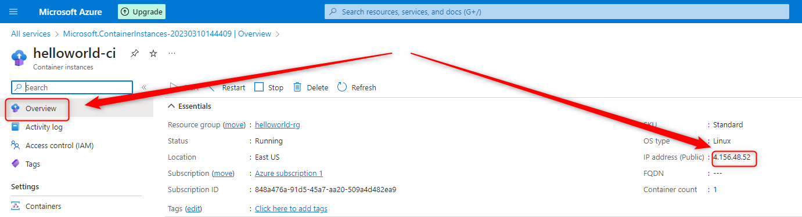

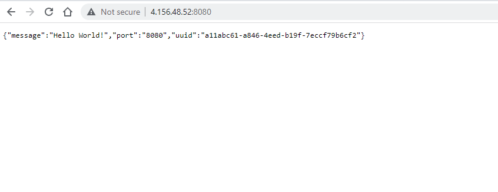

DELETE CONTAINER REGISTRY
-------------------------

Azure link:
* https://azure.microsoft.com

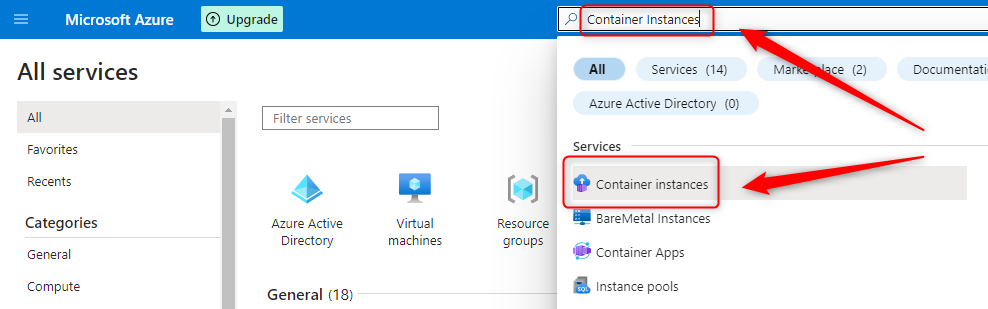

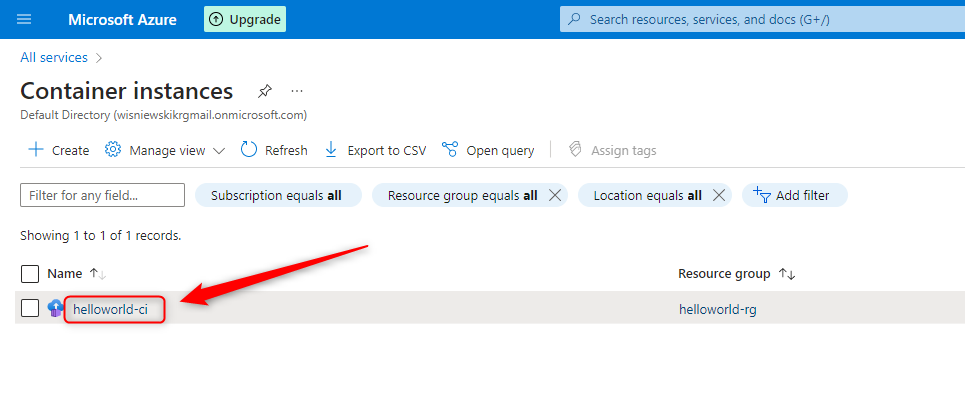

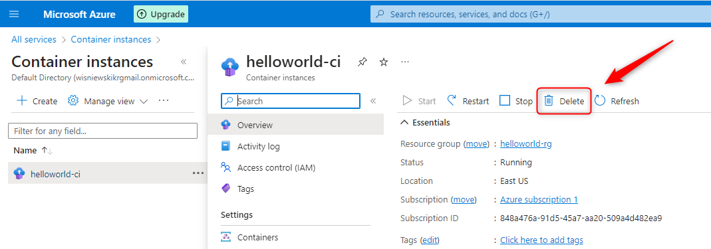

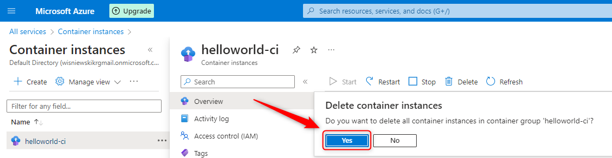

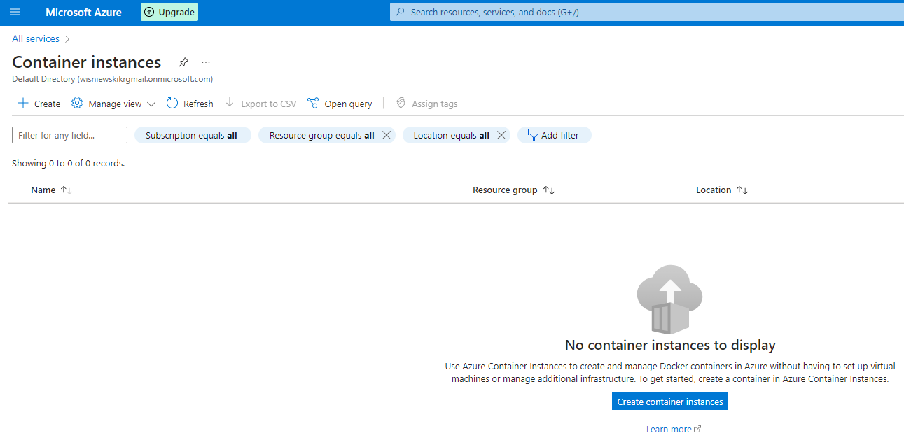

DELETE RESOURCE GROUP
---------------------

Azure link:
* https://azure.microsoft.com

