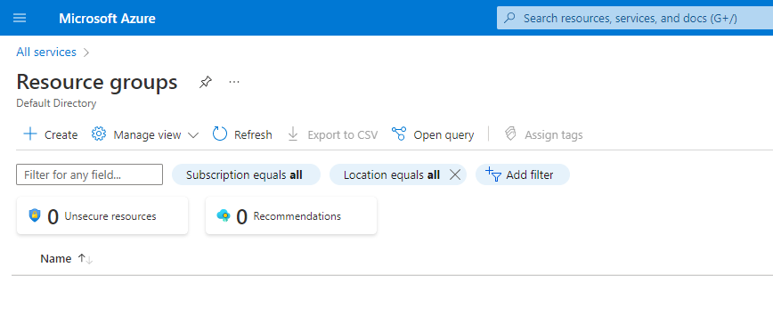

USAGE
-----

> **NOTE** This usage assumes that user has already created and is logged in to **Azure account**.

Steps:
1. Export Template of Azure Resource Group. Please check section **EPORT TEMPLATE**
1. Import Template of Azure Resource Group. Please check section **IMPORT TEMPLATE**
1. Delete Azure Resource Group. Please check section **DELETE RESOURCE GROUP**

DESCRIPTION
-----------

##### Goal
The goal of this project is to present how to use **Microsoft Azure Custom Deployment** in **Azure Portal** for exporting and importing a template of **Microsoft Azure Resource Group**.

##### Terminology
Terminology explanation:
* **Azure Portal**: this is web console for Azure Resources. Using this console user can work with Azure Resources via browser
* **Microsoft Azure Custom Deployment**: it's service provided by Azure for importing Resource templates. During creation and when Resource exists the user can export template of this Resource. Custom Deployment enables to import this Resource again to Azure Cloud.

##### Flow
The following flow takes place in this project:
1. User creates Azure Resource Group via Azure Portal
1. User exports template of Azure Resource Group
1. User imports template of Azure Resource Group using Custom Deployment service
1. User removes all Azure Resources via Azure Portal

##### Launch
To launch this application please make sure that the **Preconditions** are met and then follow instructions from **Usage** section.

##### Technologies
This project uses following technologies:
* **Microsoft Azure**: `https://docs.google.com/document/d/1HaL4gve9FyrSS2Zi7NrhHN4Y2siD_sXJugnOuGhjhCc/edit?usp=sharing`

PRECONDITIONS
-------------

##### Preconditions - Tools
* Installed **Operating System** (tested on Windows 10)

##### Preconditions - Actions
* Created Azure account

EXPORT TEMPLATE
---------------

Azure link:
* https://azure.microsoft.com

IMPORT TEMPLATE
---------------

Azure link:
* https://azure.microsoft.com

DELETE RESOURCE GROUP
---------------------

Azure link:
* https://azure.microsoft.com

