USAGE
-----

> **NOTE** This usage assumes that user is logged in to **Microsoft Azure Account**. This usage assumes that user has installed following tools: **cubectl**, **Azure Cli** and **helm**.

Steps:
1. Create Azure Resource Group. Please check section **CREATE RESOURCE GROUP**
1. Create Azure Kubernetes Service. Please check section **CREATE AKS**
1. Deploy application in Azure Kubenetes:
     * (Optional) Login to Azure Cli with `az login`
     * Configure Azure subscription with `az account set --subscription {nubmer}`
     * Configure Azure context with `az aks get-credentials --resource-group helloworld-rg --name helloworld-aks`
     * (Optional) Verify available contexts with `kubectl config get-contexts`
     * (Optional) Verify available clusters with `kubectl config get-clusters`
     * Install Ingress Controller type Nginx using tool helm with `helm upgrade --install ingress-nginx ingress-nginx --repo https://kubernetes.github.io/ingress-nginx --namespace ingress-nginx --create-namespace`
     * (Optional) Verify Ingress Controller type Nginx with `kubectl get service ingress-nginx-controller --namespace=ingress-nginx`
     * Deploy application on Kubernetes with `kubectl apply -f kubernetes.yaml`
     * (Optional) Verify Kubernetes Pods with `kubectl get pods`
     * (Optional) Verify Kubernetes Services with `kubectl get svc`
     * Get EXTERNAL-IP with `kubectl get service ingress-nginx-controller --namespace=ingress-nginx`
     * Verify application with `http://{EXTERNAL-IP}`
1. Create Azure Kubernetes Service. Please check section **DELETE AKS**
1. Delete Azure Resource Group. Please check section **DELETE RESOURCE GROUP**

DESCRIPTION
-----------

##### Goal
The goal of this project is to present how to work with **Microsoft Azure Kubernetes Services** using **Azure Platform** and **Azure Cli**. Terminology explanation:
* **Azure Platform**: this is web console for Azure Resources. Using this console user can work with Azure Resources via browser
* **Azure Cli**: it enables to manage Azure Resource via commands
* **Azure Kubernetes Service**: it provides Kubernetes as Cloud. It means that user can deploy application using Kubernetes tool in the Azure Cloud.

This project presents how to deploy Hello World application type Java Spring Boot via Kubernetes tool in the Azure Cloud. This application uses Load Balancer type Ingress provided by Nginx. Load Balancer type Ingress consists of following elements:
* **Ingress** Controller: this is installation of Load Balancer on Kubernetes. You can install Ingress provided by different vendors
* **Ingerss Configuration**: here developer configures traffic - what URL should be where redirected

##### Flow
The following flow takes place in this project:
1. User via any browser sends request to application for a content.
1. Application HelloWorld returns response with JSON containing message, port and UUID. This response is presented to User via browser.

##### Launch
To launch this application please make sure that the **Preconditions** are met and then follow instructions from **Usage** section.

##### Technologies
This project uses following technologies:
* **Java**: `https://docs.google.com/document/d/119VYxF8JIZIUSk7JjwEPNX1RVjHBGbXHBKuK_1ytJg4/edit?usp=sharing`
* **Maven**: `https://docs.google.com/document/d/1cfIMcqkWlobUfVfTLQp7ixqEcOtoTR8X6OGo3cU4maw/edit?usp=sharing`
* **Git**: `https://docs.google.com/document/d/1Iyxy5DYfsrEZK5fxZJnYy5a1saARxd5LyMEscJKSHn0/edit?usp=sharing`
* **Spring Boot**: `https://docs.google.com/document/d/1mvrJT5clbkr9yTj-AQ7YOXcqr2eHSEw2J8n9BMZIZKY/edit?usp=sharing`
* **Microsoft Azure**: `https://docs.google.com/document/d/1HaL4gve9FyrSS2Zi7NrhHN4Y2siD_sXJugnOuGhjhCc/edit?usp=sharing`

PRECONDITIONS
-------------

##### Preconditions - Tools
* Installed **Operating System** (tested on Windows 10)
* Installed **kubectl** (tested on version v1.24.0")
* Installed **Azure Cli** (tested on version 2.46.0)
* Installed **helm** (tested on version v3.11.1)

##### Preconditions - Actions
* Created Azure account
* Java Spring Boot application source code deployed on Github. Link: `https://github.com/wisniewskikr/java-springboot-helloworld`
* Java Spring Boot application Docke Image deployed on Docker Hub. Link: `https://hub.docker.com/repository/docker/wisniewskikr/java-springboot-helloworld/general`

CREATE RESOURCE GROUP
---------------------

Link:
* https://portal.azure.com/

CREATE AKS
----------

Link:
* https://portal.azure.com/

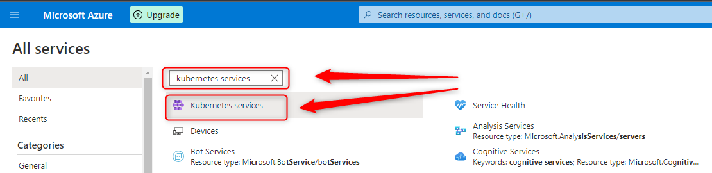

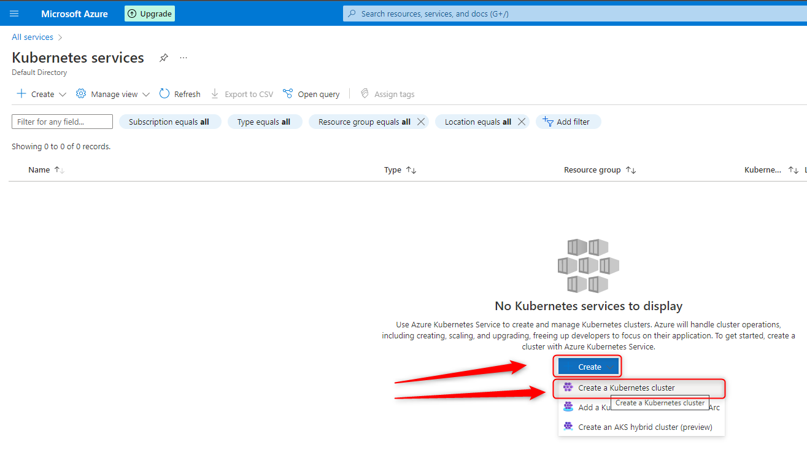

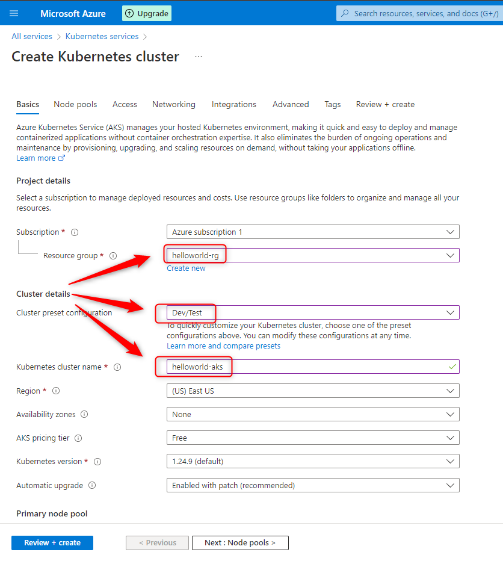

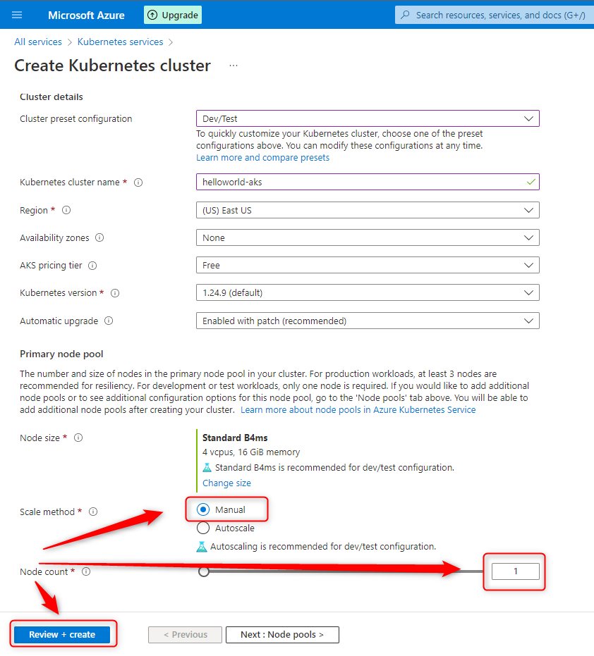

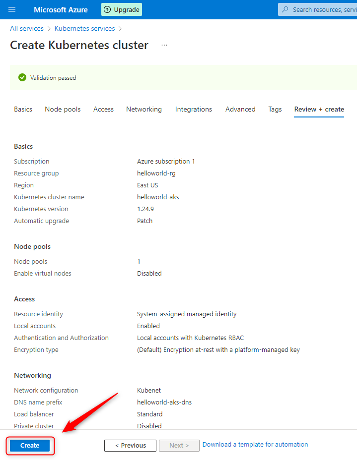

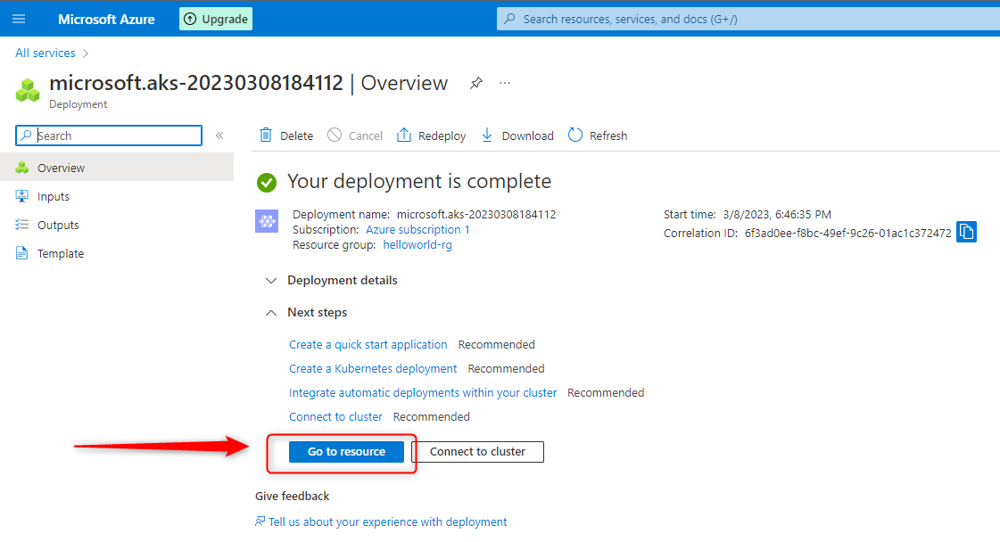

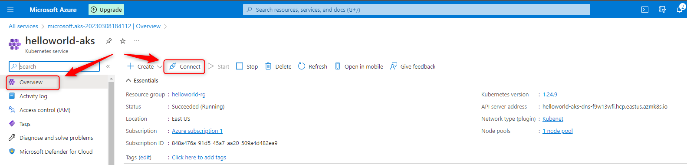

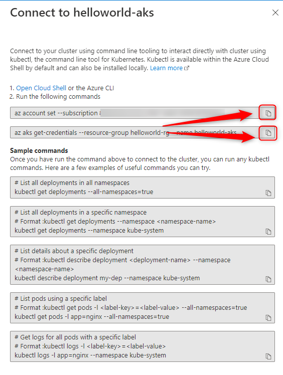

DELETE AKS
----------

Link:
* https://portal.azure.com/

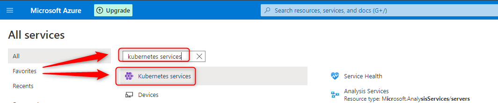

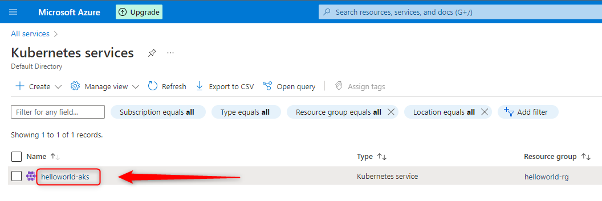

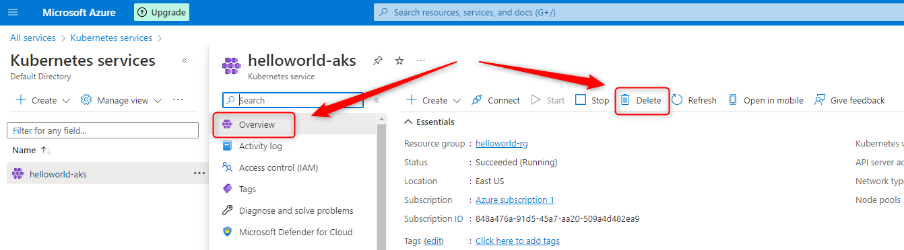

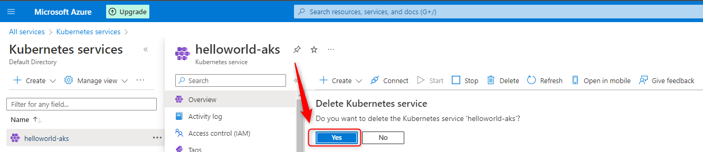

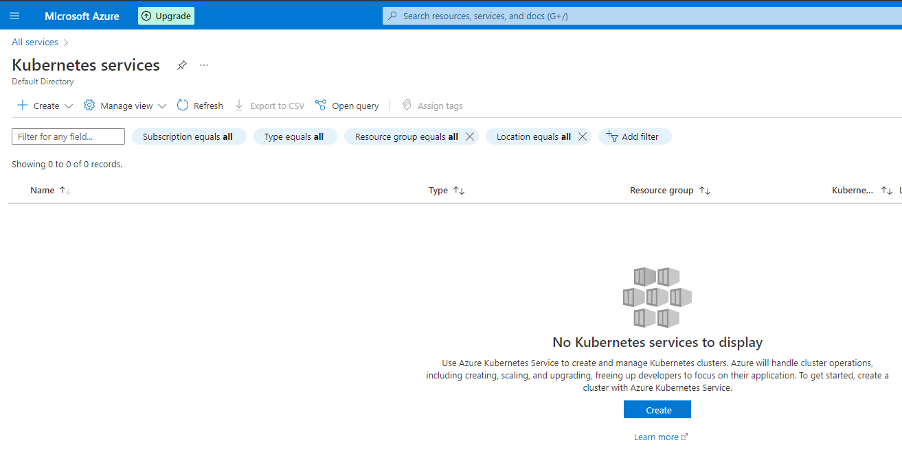

DELETE RESOURCE GROUP
---------------------

Link:
* https://portal.azure.com/

