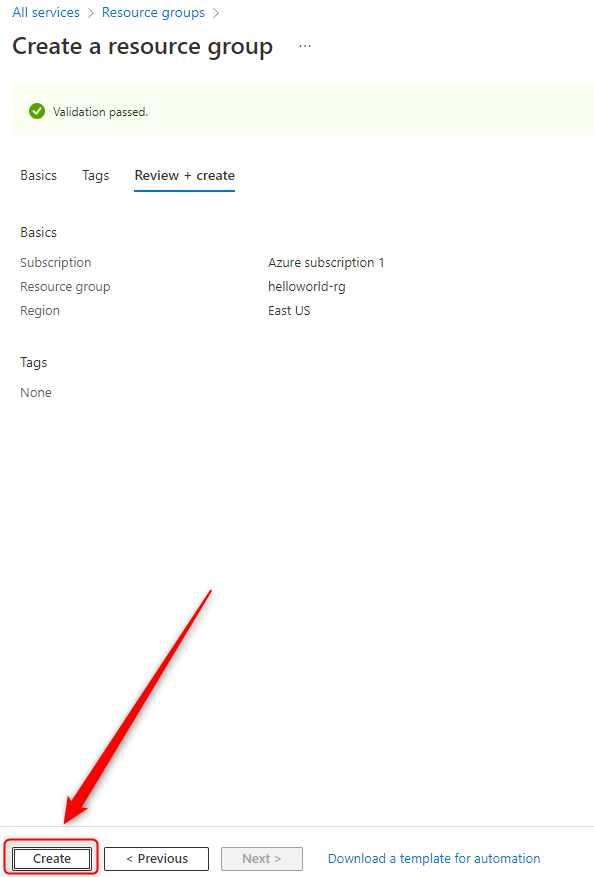

USAGE
-----

> **NOTE** This usage assumes that user has already created and is logged in to **Azure account**.

Steps:
1. Create Azure Resource Group. Please check section **CREATE RESOURCE GROUP**
1. Delete Azure Resource Group. Please check section **DELETE RESOURCE GROUP**

DESCRIPTION
-----------

##### Goal
The goal of this project is to present how to work with Microsoft Azure Resource Groups.

Resource Groups is some kind of container for Azure Resources. Every Resource has to belong to some Resource Group. 

CREATE RESOURCE GROUP
---------------------

Azure link:
* https://azure.microsoft.com

DELETE RESOURCE GROUP
---------------------

Azure link:
* https://azure.microsoft.com

