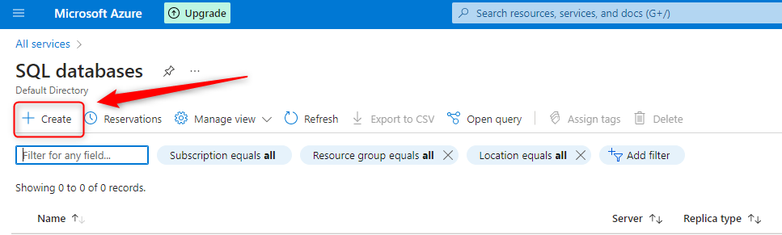
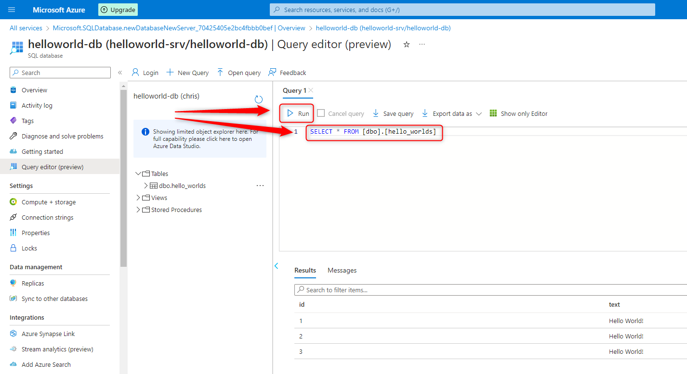
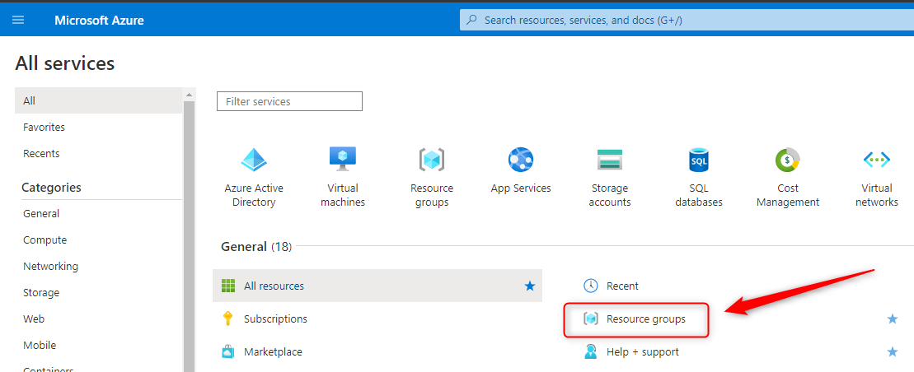

USAGE
-----

> **NOTE** This usage assumes that user is logged in to **Microsoft Azure Account**. This usage assumes that user has installed following tools: **Java** and **Maven**.

Steps:
1. Create Azure Resource Group. Please check section **CREATE RESOURCE GROUP**
1. Create Azure SQL Database. Please check section **CREATE SQL DATABASE**
1. Update file **src/main/resources/application.yml**:
     * url
     * username
     * password
1. Run application:
     * Start application with `mvn spring-boot:run`
     * Visit `http://localhost:8080`
     * Clean up environment with `ctrl + C`
1. Delete Azure SQL Database. Please check section **DELETE SQL DATABASE**
1. Delete Azure Resource Group. Please check section **DELETE RESOURCE GROUP**

DESCRIPTION
-----------

##### Goal
The goal of this project is to present how to work with **Microsoft Azure SQL Databases** using **Azure Platform**. Terminology explanation:
* **Azure Platform**: this is web console for Azure Resources. Using this console user can work with Azure Resources via browser
* **Azure SQL Database**: it's service provided by Azure for creating and managing MS SQL database

This project presents how to implement Hello World application type Java Spring Boot which uses MS SQL database deployed in Azure Cloud

##### Flow
The following flow takes place in this project:
1. User via any browser sends request to application for a content.
1. Application HelloWorld returns response with JSON containing message. This message is first stored in database and then read from database

##### Launch
To launch this application please make sure that the **Preconditions** are met and then follow instructions from **Usage** section.

##### Technologies
This project uses following technologies:
* **Java**: `https://docs.google.com/document/d/119VYxF8JIZIUSk7JjwEPNX1RVjHBGbXHBKuK_1ytJg4/edit?usp=sharing`
* **Maven**: `https://docs.google.com/document/d/1cfIMcqkWlobUfVfTLQp7ixqEcOtoTR8X6OGo3cU4maw/edit?usp=sharing`
* **Git**: `https://docs.google.com/document/d/1Iyxy5DYfsrEZK5fxZJnYy5a1saARxd5LyMEscJKSHn0/edit?usp=sharing`
* **Spring Boot**: `https://docs.google.com/document/d/1mvrJT5clbkr9yTj-AQ7YOXcqr2eHSEw2J8n9BMZIZKY/edit?usp=sharing`
* **Microsoft Azure**: `https://docs.google.com/document/d/1HaL4gve9FyrSS2Zi7NrhHN4Y2siD_sXJugnOuGhjhCc/edit?usp=sharing`

PRECONDITIONS
-------------

##### Preconditions - Tools
* Installed **Operating System** (tested on Windows 10)
* Installed **Java** (tested on version 17.0.5)
* Installed **Maven** (tested on version 3.8.5)
* Installed **Git** (tested on version 2.33.0.windows.2)

##### Preconditions - Actions
* Created Azure account
* **Download** source code using Git 
* Open any **Command Line** (for instance "Windonw PowerShell" on Windows OS) tool on **project's folder** (exact localization of project you can check in GIT repositories on page `https://github.com/wisniewskikr/chrisblog-it-azure`)

CREATE RESOURCE GROUP
---------------------

Link:
* https://portal.azure.com/

CREATE SQL DATABASE
-------------------

Link:
* https://portal.azure.com/

DELETE SQL DATABASE
-------------------

Link:
* https://portal.azure.com/

DELETE RESOURCE GROUP
---------------------

Link:
* https://portal.azure.com/

