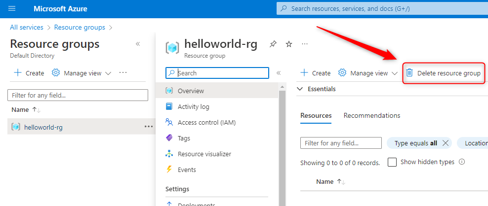

USAGE
-----

> **NOTE** This usage assumes that user has already created and is logged in to **Azure account**.

Steps:
1. Create Azure Resource Group. Please check section **CREATE RESOURCE GROUP**
1. Create Azure Storage Account. Please check section **CREATE STORAGE ACCOUNT**
1. Delete Azure Storage Account. Please check section **DELETE STORAGE ACCOUNT**
1. Delete Azure Resource Group. Please check section **DELETE RESOURCE GROUP**

DESCRIPTION
-----------

##### Goal
The goal of this project is to present how to work with **Microsoft Azure Storage Account** using **Azure Platform**. Terminology explanation:
* **Azure Platform**: this is web console for Azure Resources. Using this console user can work with Azure Resources via browser
* **Azure Storage Account**: it's service provided by Azure for storing files

This project presents how to upload and download file **test.json** to and from Azure Cloud. 

CREATE RESOURCE GROUP
---------------------

Azure link:
* https://azure.microsoft.com

CREATE STORAGE ACCOUNT
----------------------

Azure link:
* https://azure.microsoft.com

DELETE STORAGE ACCOUNT
----------------------

Azure link:
* https://azure.microsoft.com

DELETE RESOURCE GROUP
---------------------

Azure link:
* https://azure.microsoft.com

