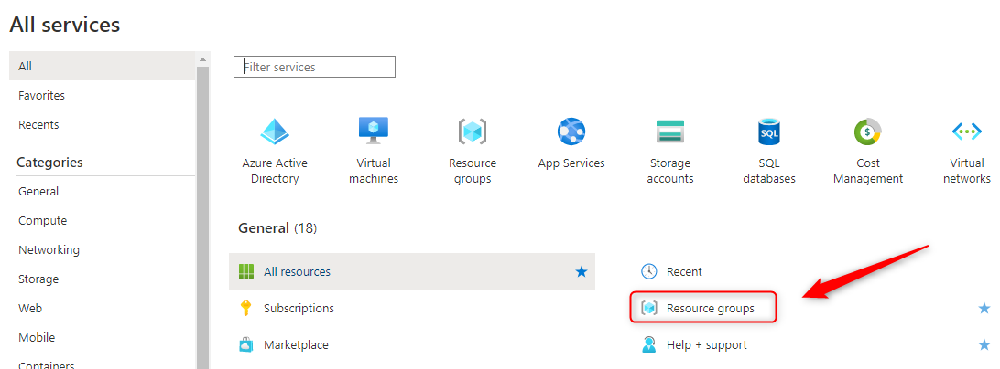
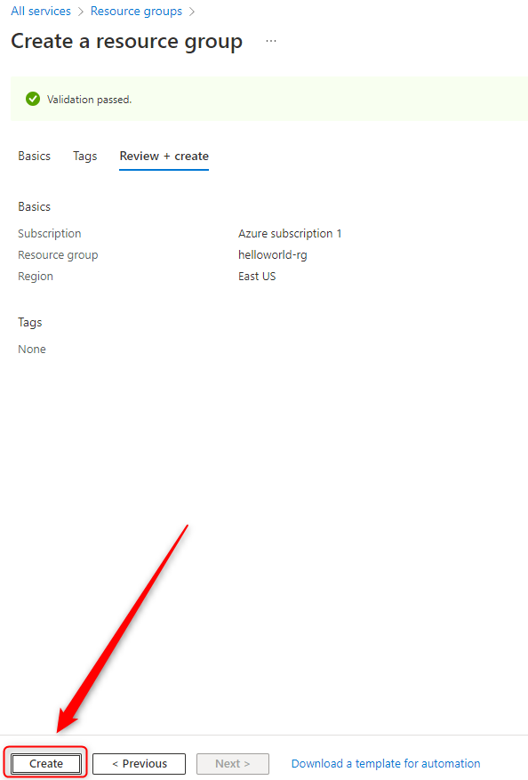
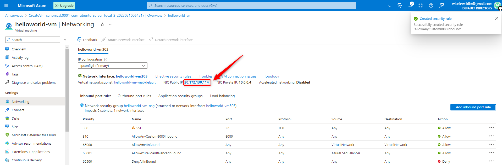
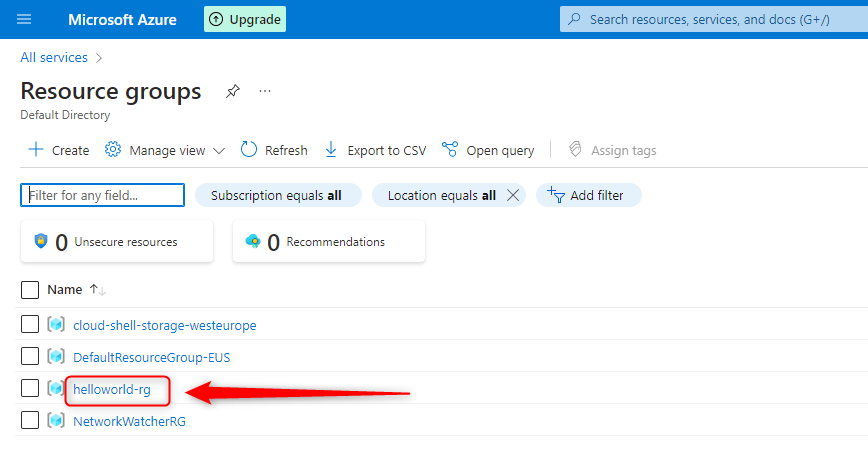

USAGE
-----

> **NOTE** This usage assumes that user is logged in to **Microsoft Azure Account**. This usage assumes that user has installed following tools: **PuTTY**.

Steps:
1. Create Azure Resource Group. Please check section **CREATE RESOURCE GROUP**
1. Create Azure Virtual Machine. Please check section **CREATE VIRTUAL MACHINE**
1. Connect with Azure Virtual Machine using SSH and tool PuTTY. Please check section **CONNECT WITH PUTTY**
1. Run application:
     * (Optional) Verify Java installation with `java -version`
     * (Optional) Verify Maven installation with `mvn -version`
     * (Optional) Verify Git installation with `git --version`
     * Clone source code with `git clone https://github.com/wisniewskikr/chrisblog-it-azure.git`
     * Navigate to application folder with `cd chrisblog-it-azure/azure-virtual-machine/java-springboot-helloworld-vm-portal`
     * Start application with `mvn spring-boot:run`
     * Visit `http://{public-ip}:8080`
     * Clean up environment with `ctrl + C`
1. Delete Azure Virtual Machine. Please check section **DELETE VIRTUAL MACHINE**
1. Delete Azure Resource Group. Please check section **DELETE RESOURCE GROUP**


DESCRIPTION
-----------

##### Goal
The goal of this project is to present how to configure **Microsoft Azure Virtual Machine** using **Azure Portal** and then connect with this VM using SSH (tool **PuTTY**) to install and run **Java Spring Boot** application.

##### Terminology
Terminology explanation:
* **Azure Portal**: this is web console for Azure Resources. Using this console user can work with Azure Resources via browser
* **Azure Virtual Machine**: it's service provided by Azure for creating Virtual Machines. In other words it's like virtual computer with Disk, RAM, CPU etc. And like on regural computer user can install there required applications
* **Java Spring Boot application**: application in Java programming language which uses Spring Boot framework. This application just displays text "Hello World!"

##### Flow
The following flow takes place in this project:
1. User creates Azure Resource Group via Azure Portal
1. User creates Azure Virtual Machine (with preinstalled Java, Maven and Git) via Azure Portal
1. User connects with VM via SSH via tool PuTTY
1. User downloads application's source code via GIT
1. User starts application via Maven command
1. User via any browser sends request to application for a content.
1. Application HelloWorld returns response with JSON containing message, port and UUID. This response is presented to User via browser.
1. User removes all Azure Resources via Azure Portal

##### Launch
To launch this application please make sure that the **Preconditions** are met and then follow instructions from **Usage** section.

##### Technologies
This project uses following technologies:
* **Java**: `https://docs.google.com/document/d/119VYxF8JIZIUSk7JjwEPNX1RVjHBGbXHBKuK_1ytJg4/edit?usp=sharing`
* **Maven**: `https://docs.google.com/document/d/1cfIMcqkWlobUfVfTLQp7ixqEcOtoTR8X6OGo3cU4maw/edit?usp=sharing`
* **Git**: `https://docs.google.com/document/d/1Iyxy5DYfsrEZK5fxZJnYy5a1saARxd5LyMEscJKSHn0/edit?usp=sharing`
* **Spring Boot**: `https://docs.google.com/document/d/1mvrJT5clbkr9yTj-AQ7YOXcqr2eHSEw2J8n9BMZIZKY/edit?usp=sharing`
* **Microsoft Azure**: `https://docs.google.com/document/d/1HaL4gve9FyrSS2Zi7NrhHN4Y2siD_sXJugnOuGhjhCc/edit?usp=sharing`
* **SSH**


PRECONDITIONS
-------------

##### Preconditions - Tools
* Installed **Operating System** (tested on Windows 10)
* Installed **PuTTY** (tested on version 0.78)

##### Preconditions - Actions
* Created Azure account


CREATE RESOURCE GROUP
---------------------

Link:
* https://portal.azure.com/







CREATE VIRTUAL MACHINE
----------------------

Link:
* https://portal.azure.com/

User Data Code:

```
#!/bin/sh

# Update Ubuntu
sudo apt update

# Install Java 11
sudo apt install -y openjdk-11-jdk openjdk-11-jre

# Install Maven
sudo apt install -y maven

# Install Git
sudo apt install -y git
```





CONNECT WITH PUTTY
------------------


DELETE VIRTUAL MACHINE
----------------------

Link:
* https://portal.azure.com/





DELETE RESOURCE GROUP
---------------------

Link:
* https://portal.azure.com/


