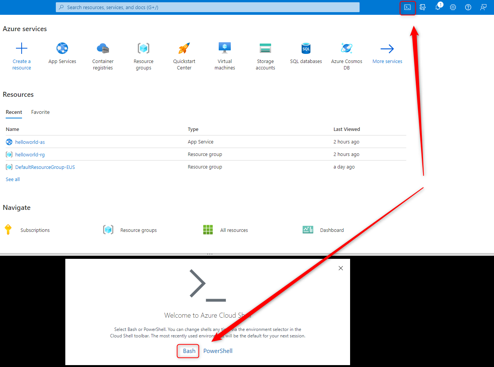
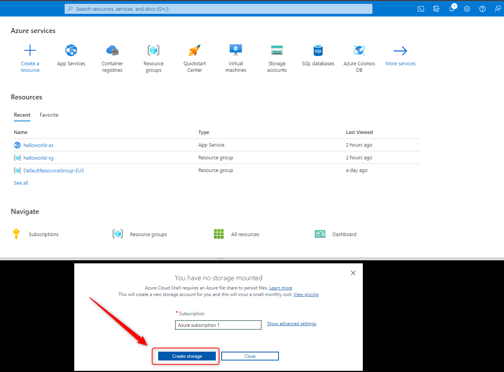
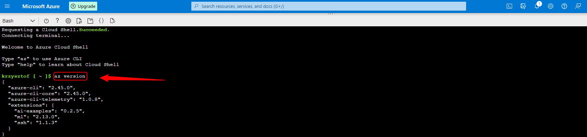

DESCRIPTION
-----------

##### Goal
The goal of this project is to present how to use **Azure Cli** on **Azure Portal**.

Azure Cli enables managing Azure Resources using the commands. You can use Azure Cli in following ways:
* **On Local Computer**: to use Azure Cli on your local computer you have to install this tool.
* **On Azure Portal**: you can use Azure Cli from Azure Portal.
* **On Browser**: you can use Azure Cli just on any browser.

Documentation: `https://docs.google.com/document/d/1HaL4gve9FyrSS2Zi7NrhHN4Y2siD_sXJugnOuGhjhCc/edit?usp=sharing`

CONFIGURATION AZURE CLI ON AZURE PORTAL
---------------------------------------

Link:
* https://portal.azure.com/

